# Static Website Hosting Using AWS S3 & Route 53

## Project Overview
This project demonstrates hosting a static website using *AWS S3* with a custom domain configured via *AWS Route 53*.  
The setup ensures *high availability, scalability, and public access*.

---

## Architecture
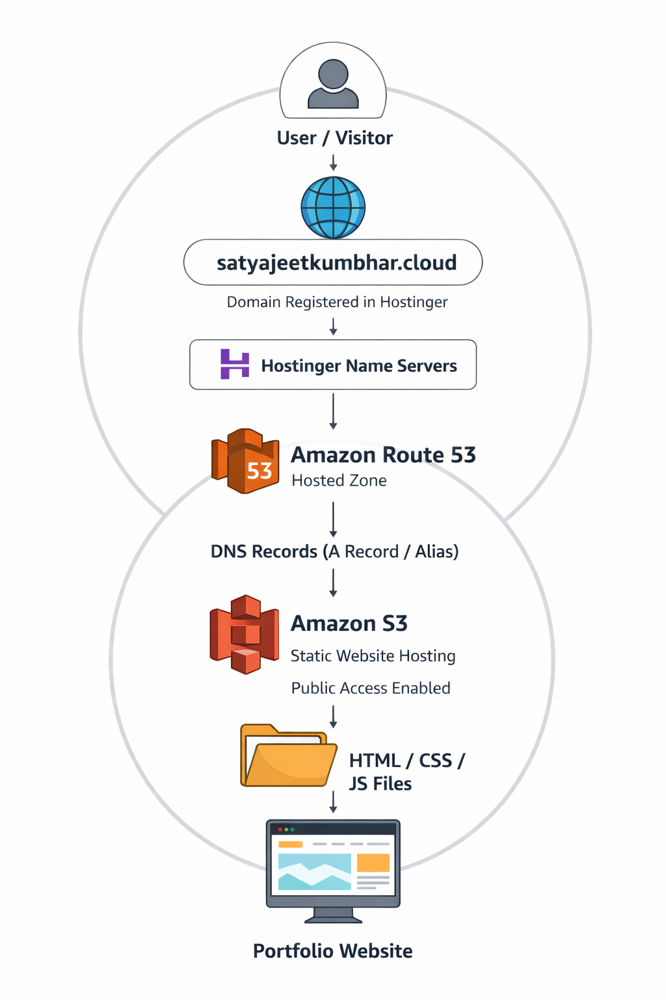
---

# Project Workflow

1. User enters the website domain in a browser.
2. The request goes to Route 53 for DNS resolution.
3. Route 53 routes the request to the S3 bucket endpoint.
4. S3 fetches the static website files.
5. The browser loads and displays the website.

---
#  Implementation Step

## Step 1: Create an S3 Bucket

1. Open AWS Console
2. Go to *S3 Service*
3. Click *Create Bucket*
4. Enter a unique bucket name *(techuttam.cloud)*
5. Select region *(N.Verginia)*
6. Disable *Block Public Access*
7. Create the bucket
---
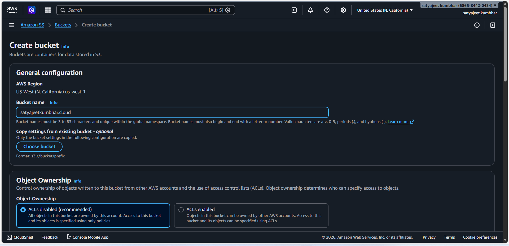
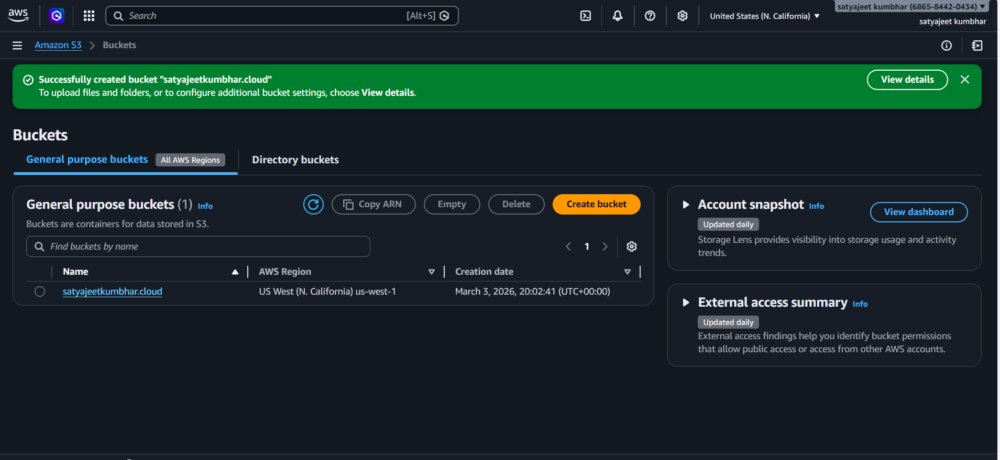
---

## Step 2: Upload Website Files
*index.html*

*images*
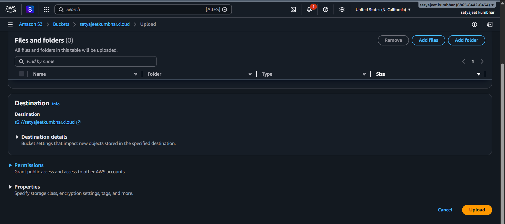

*Upload Succeeded*
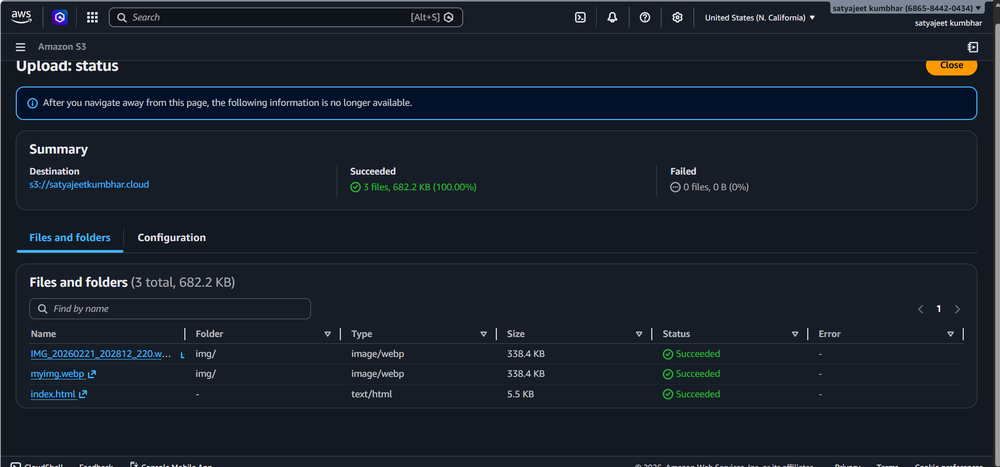)

---

## Step 3: Enable Static Website Hosting

1. Open your S3 bucket
2. Go to *Properties*
3. Scroll to *Static Website Hosting*
4. Click *Enable*
5. Index document: *index.html*
6. Error document: error.html (optional)
7. Enter:
8. Successfully 

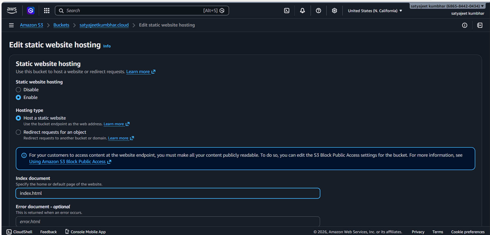

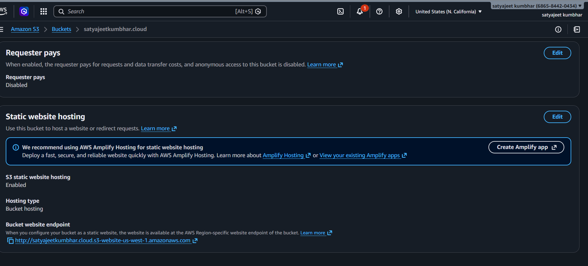)

---

Step 5: Configure Route 53

- Open Route 53

- Go to *Public Hosted Zones*

- Create a domain name *techuttam.cloud*

- Create a new record

Record type:

A Record

Alias:

Yes

Alias target:

S3 Static Website Endpoint

Save the record.

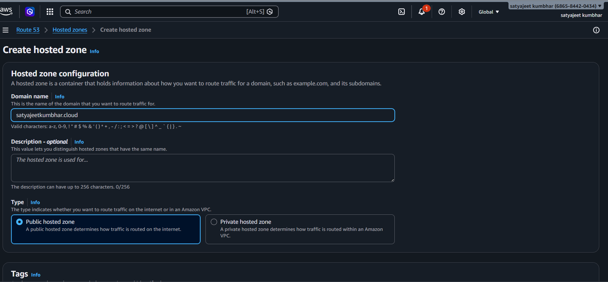

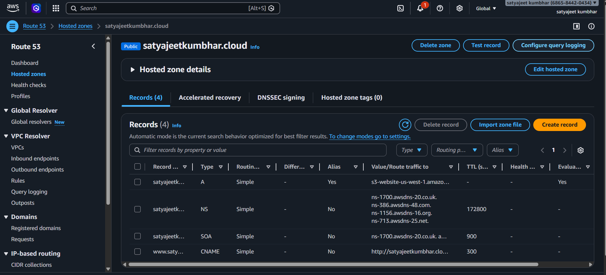

---

## Testing the Website

- Wait for DNS propagation (may take up to 24 hours).
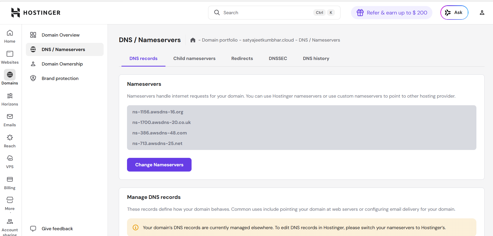

## Open domain in a browser:

https://satyajeetkumbhar.cloud

## static website should now load from the S3 bucket.

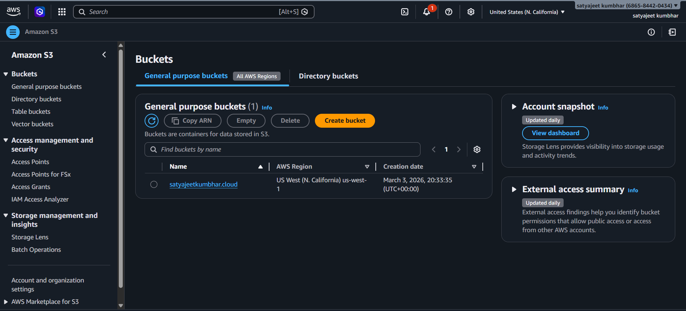

---

# Output

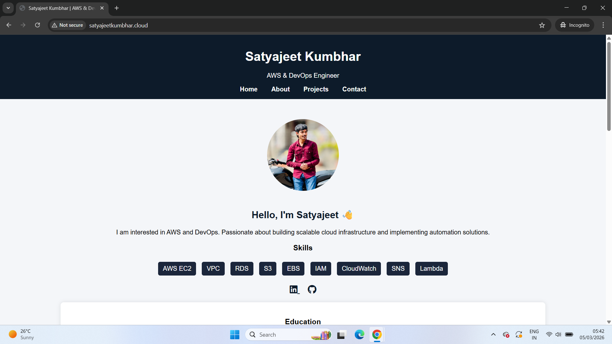

Benefits of This Architecture

- Low cost hosting

- Highly scalable

- Fully managed infrastructure

- High availability

- Easy to deploy and maintain

## Technologies Used

- AWS S3

- AWS Route 53

- HTML

- CSS

- JavaScript
## Contact

Author: Satyajeet Kumbhar

Email: satyajeetkumbhar72@gmail.com

LinkedIn: https://www.linkedin.com/in/satyajeet-kumbhar-42a0b6373?utm_source=share_via&utm_content=profile&utm_medium=member_android